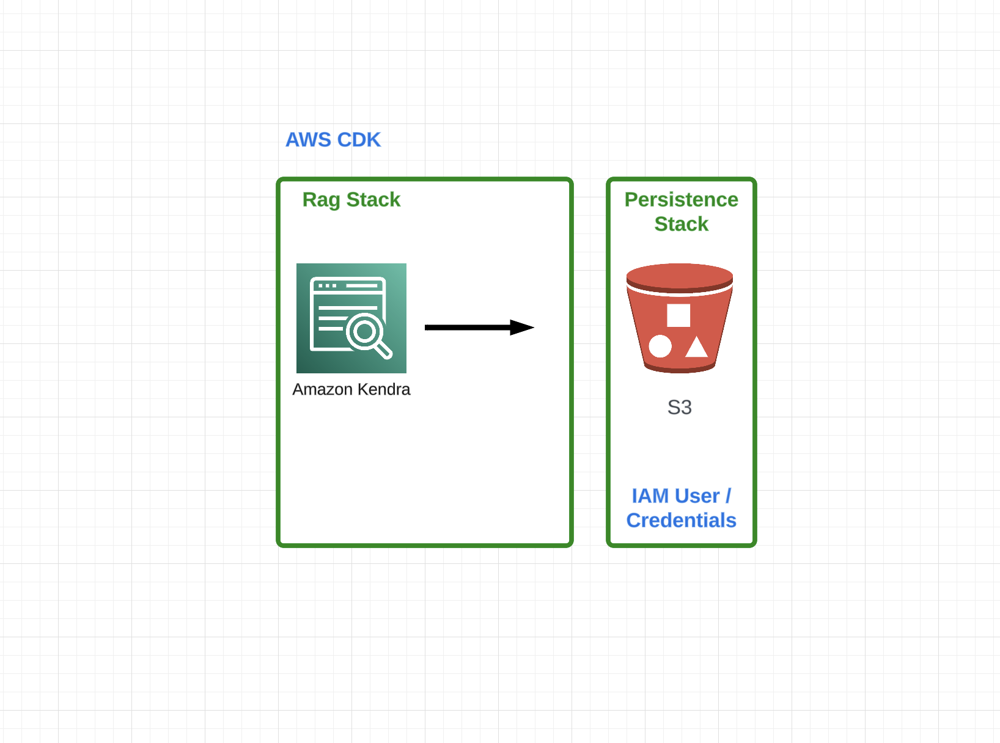
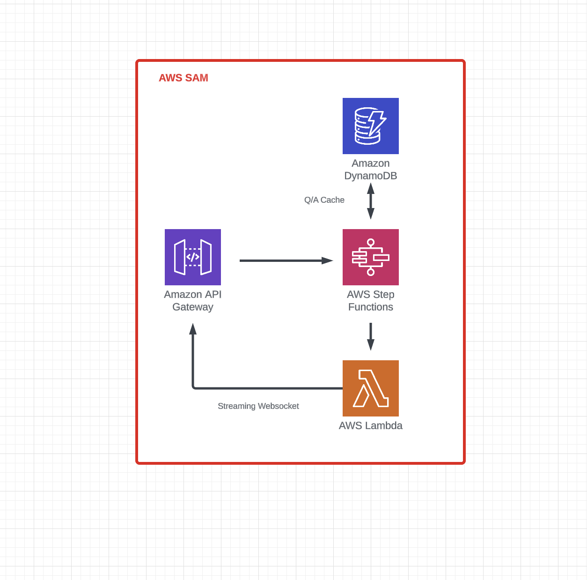

# RACH

A **RA**g-**CH**atbot framework used to demonstrate the [AI Alliance](https://github.com/The-AI-Alliance) [trust, safety](https://the-ai-alliance.github.io/trust-safety-user-guide/) and [evaluation](https://github.com/The-AI-Alliance/trust-safety-evals) initiatves.


## Overview


This framework consists of three components implemented using Amazon Web Services (AWS) Serverless:
1. RAG storage and retrieval
2. Inference
3. User Interface

### RAG storage and retrieval


The RAG storage and retrieval components is implemented using [Amazon's Cloud Development Kit (CDK)](https://aws.amazon.com/cdk/). It consists of two stacks:

1. **Persistence Stack**
    - an S3 bucket for storing RAG documents, optionally replicated across multiple regions
    - an AWS service account (IAM user) in order to access the S3 bucket external to AWS
    - all the IAM roles and policies allowing the AWS service account write only on the S3 bucket

2. **RAG Stack**
    - an [Amazon Kendra](https://aws.amazon.com/kendra/) instance to search and query the documents in the S3 bucket
    - all the IAM roles and policies to allow Kendra to read / index the documents in the S3 bucket

### Inference


The inference engine is implemented using [Amazon's Serverless Application Model (SAM)](https://aws.amazon.com/serverless/sam/). It is based on a reference implementation published on [AWS Serverlessland](https://github.com/shafkevi/lambda-bedrock-s3-streaming-rag). Its purpose is to act as a scalable, fault tolerant, streaming interface into AWS Bedrock, and consists of the following components:

1. **AWS Step Functions**
   - Responsible for formatting the inference request with the results of the RAG search, and caching the results in DynamoDB
2. **AWS Dynamo DB**
   - The main caching layer and maintains context
3. **AWS API Gateway**
   - The interface to the user experience

### User Interface
This impressive application combines cutting-edge technology and user experience, utilizing React for the dynamic user interface and seamless integration with Firebase for secure authentication and real-time data management. The solution features a sophisticated chatbot powered by WebSocket communications, a robust data preparation suite, and an evaluation management system, all delivered with an intuitive design powered by the React Bootstrap framework. It showcases the transformative power of modern web technologies to create interactive, data-driven applications that drive innovation and efficiency. This state-of-the-art platform exemplifies the potential of a well-orchestrated tech stack to deliver impactful, user-friendly solutions.

## Deployment

### Requirements

* [Create an AWS account](https://portal.aws.amazon.com/gp/aws/developer/registration/index.html) if you do not already have one and log in. The IAM user that you use must have sufficient permissions to make necessary AWS service calls and manage AWS resources.
* [AWS CLI](https://docs.aws.amazon.com/cli/latest/userguide/install-cliv2.html) installed and configured
* [Git Installed](https://git-scm.com/book/en/v2/Getting-Started-Installing-Git)
* [AWS Serverless Application Model](https://docs.aws.amazon.com/serverless-application-model/latest/developerguide/serverless-sam-cli-install.html) (AWS SAM) installed
* [AWS Cloud Development Kit](https://docs.aws.amazon.com/cdk/v2/guide/getting_started.html) (AWS CDK) installed
* [Docker Installed and Running](https://docs.aws.amazon.com/serverless-application-model/latest/developerguide/install-docker.html)


### Steps

1. Create a new directory, navigate to that directory in a terminal and clone the GitHub repository:
    ``` 
    git clone https://github.com/The-AI-Alliance/RACH.git
    ```
1. Change directory to the pattern directory:
    ```
    cd RACH
    ```
1. Modify `./app.py` with your AWS dev/qa/prod account ids.

1. Use the AWS CDK CLI to deploy the RAG storage and retrieval framework
    ```
    cdk synth
    cdk deploy chatbots-dev
    ```
1. The output of this step will consist of an AWS Kendra index id (GUID). 

1. From the command line, use AWS SAM to deploy the AWS resources for the pattern as specified in the template.yml file. Modify the `samconfig-chatbot.toml` with the Kendra index id from above, and modify the Bedrock models as you see fit.
    ```
    sam build -u
    sam deploy --config-file samconfig-chatbot.toml
    ```
1. The output of this step will be the websocket (wss) endpoint on AWS API Gateway. Plug this into the user interface to complete the deployment.

### Ingest Documents
Once your stack has been deployed, you can add PDF documents into the S3 bucket. The IAM user created has rights to do so. The RAG framework will need to update the index, this must be done manually using the AWS Kendra UI.

### Teardown
1. Tear down the SAM deployment.
   ```
   sam delete --stack-name chatbot
   ```
1. Tear down the CDK deployment.
   ```
   cdk destroy chatbots
   ```